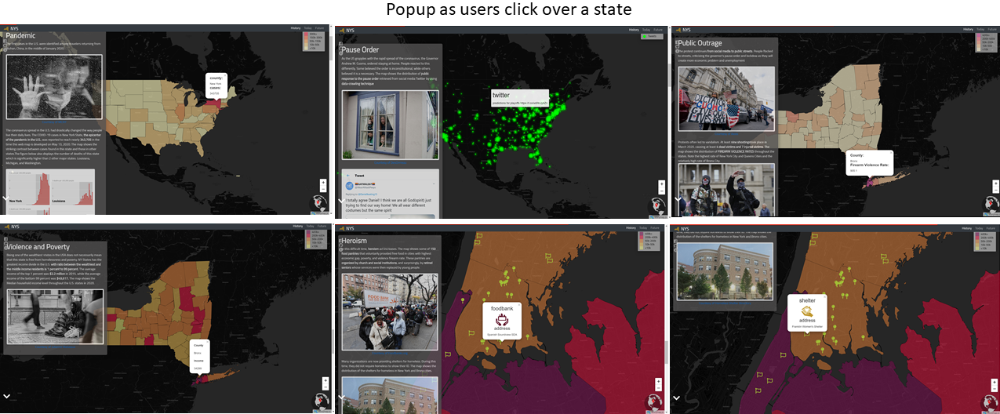
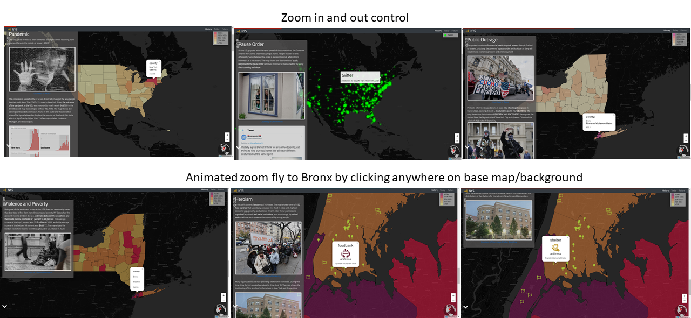

# storymap

 <br>
## Resilience Story of New York<br>
### :newspaper: Introduction
The aim of this storymap is to represent the strugggles of the people in New York State in the face of **`COVID-19 pandemic`**, that is complicated with unresolved social-economic inequity. This storymap is inspired by the success of digital technology-based storymaps in mobilizing social power towards a desired change (James, Kitchin and Leszczynski 2018, 26) .<br>

> According to notable scholar [Holling](https://core.ac.uk/download/pdf/52941869.pdf), resilience is the persistence of relationships within a system. It is a measure of the ability of the systems to absorb changes. Digital Geography is a set of technologies that go beyond an engagement with an interface, but also involves spatial big data. Due to social power it has, many like [TeachMideast](https://teachmideast.org/articles/digital-geography-applications/) called story map as **`human document`**<br>

### :hammer: Storyline
In the process of creating this storymap, I primarily developed a storyline by referring to the compeling work of [Song, Z.](https://link.springer.com/book/10.1007%2F978-3-030-04028-4). This storymap is intended for all public audience. By using **New York State**, the **`epicenter`** of this country's pandemic, it is hoped that users can gain some important lessons to cope with and mitigate hazard impacts. Among different types of **`genres`**  offered in Roth's Taxonomy (2016), I adopt multimedia experienced genre which uses *layout, text, images, and graphics hyperlinks* to enforce a **systematic narrative**. Below are the sketches and brief descriptions of the map's storyline.<br>

The **`first page`** contains a video of New York City which I obtained from [The New Yorkers](https://www.youtube.com/watch?v=rYTNO_WtNys) youtube. To dramatize the visualization, I re-touched the video color to get vintage (old) nuance. On this page, users can  access many useful links related to New York State (i.e., history, present conditions, and future resilient city ), real-time data of COVID-19 case, NY State Government's official website, and social media. The **`second page`** contains the first scene of the story, that is the introduction of the COVID-19 issue in May 2020 in New York State. <br>

<br>

The **`third page`** contains the second scene of the story entitled Pause Order that has raised criticism from manjority of U.S. citizens. The **`fourth page`** contains the third scene of the story called outrage. This scene specifically discusses public protests which unexpectedly, led to violence and gunshooting. I associated the incidents with the 'violence firearm rate data' in 2017 at country level. <br>

<br>

The **`fifth page`** contains the fourth scene called Poverty. I linked the violence rate with poverty level. To represent poverty, I used median household income level data in 2015 at state level. The **`sixth page`** contains the last scene called volunteer where heroism acts increase during the pandemic. Among many evidences on this topic, food pantry and homeless shelter were used to demonstrate the good value that rose from this challenge.<br>

<br>

The **`seventh page`** contains the conflict's resolutions-'working together' and 'trusting scientists'-suggested by a local citizen. The storymap is closed with lists of acknowledgement and references using vertical animated text. <br>

<br>

The 3 narrative elements of this web map include:
<br>
1. **Set-Up Act**<br>
In terms of **`settings`**, the locus of this storymap is New York State that comprises 62 counties. The **`key characters`** are the citizens of the New York State and the Governor Andrew Cuomo. The **`problem`** is the pandemic that disrupts the lives of people in the New York State and was complicated by public outrage due to the Governor's Pause Order. The **`time frame`** is the current time where the pandemic and pause order are still taking place.<br>

<br>

2. **Conflict Act**<br>
The **`key issue`** of the story is the increasing vulnerability of people in New York State to the pandemic due to the high level of poverty and violance firearm rates in this state. All factors linked to the pandemic were transferred into thematic maps (i.e., COVID-19 case, tweets over pause order, median household income, violance firearm rate, voluntary centers) in a linear order. <br>

<br>

3. **Resolution Act**<br>
The **`recommendations`** offered are: 1) the need of people to embrace the pandemic as a opportunity to innovate, change, and reconsider the value of social cohesion to increase resilience to pandemic; 2) working together and listening to scientists to
deal with the pandemic as suggested by a local resident and shown on the seventh page of this storymap.<br>

<br>

## :mag_right: Data Sources
This storymap used data that are compiled from various resources mainly belong to the U.S. and state's governments, electronic mass media, organization's websites, and twitter. For creating spatial maps, most of these data, need to be converted into GeoJson file. For *pointToLayer* use, I added longitude and latitude of the location of each food pantry and homeless shelter into Geojson files. To obtain the location coordinates, I accessed the addresses of those places via google map. For the layers' colors, I utilized [bivariate choropleth palette benerator](https://jakobzhao.github.io/storymap/assets/color.html). <br>

| Data file | Data Type | Description| Sources |
| --------- | --------- | ---------- | ------- |
| uscases.geojson | vector | Number of COVID-19 cases and tests run in the U.S. based on CDC's report on May 13, 2020 | https://github.com/datasets/covid-19/tree/master/data |
| tweets.geojson | vector | Distribution of tweets corresponding to **pause order**. Data were gathered by using tweets crawling on June 5, 2020 | Tweeter Inc. |
| nys_viol_rate.geojson | vector | Index, Violent, property and firearm rates in NY states on November 2017| https://catalog.data.gov/dataset/index-violent-property-and-firearm-rates-by-county-beginning-1990/resource/d1e392ad-8377-4ca7-8b36-7c43bb275afc |
| nyspvt.geojson | vector | Median household income of New York State in 2015 with longitude and latitude coordinates | https://data.ny.gov/Energy-Environment/NYSERDA-Low-to-Moderate-Income-New-York-State-Cens/bui8-bb6g/data |
| shelter.geojson | vector | Locations of homeless shelters in Bronx in May 2020 with longitude and latitude coordinates | https://www.homelessshelterdirectory.org/cgi-bin/id/city.cgi?city=bronx&state=NY |
| food.geojson | vector | Location of food pantries in Bronx and surrounding in May 2020 with longitude and latitude coordinates | https://www.foodpantries.org/ci/ny-bronx |

<br>

## :books: Libraries
Below is the table that shows the data library of this storymap.

| **Library**       | **Version** | **Function**                                                                                                                   |
| ----------------- | ----------- | ------------------------------------------------------------------------------------------------------------------------------ |
| leaflet.css       | 1.4.0       | Codes for storymap making (e.g., events, animation)                                                                            |
| ajax              | 3.5.2       | Animation                                                                                                                      |
| googleapis        |             | Fonts and stylesheets                                                                                                          |
| fontawesome       | 5.7.2       | Icon markers                                                                                                                   |
| chroma            | 1.3.4       | Colors setting (e.g., chloropleth)                                                                                             |
| jquery            | 3.2.1       | Animation                                                                                                                      |
| popper.js         | 1.14.0      | Positioning engine by calculating the position of an element to make it possible to position it near a given reference element |
| bootstrap.min.css | 4.3.1       | Building responsive web map through complied source codes of css and js                                                        |
| leaflet-ajax      | 2.1.0       | Asynchronously adding geojson data                                                                                             |
| topojson.min.js   |             | Etension of GeoJSON that encodes topology                                                                                      |
| storymap          | 2.5         | Support storymap and make it robust and lightweight                                                                            |

The basemap used for this storymap is attributed to cartodb_basemaps with code as follows:
```js
cartodb_dark: {
  layer: L.tileLayer('http://cartodb-basemaps-{s}.global.ssl.fastly.net/dark_all/{z}/{x}/{y}@2x.png', {
    attribution: "Generated by QMetaTiles",
    detectRetina: true
```

The miniglobe added to the storymap was retrieved from Chris Whong's leaflet example in the github with URL: https://github.com/chriswhong/leaflet-globeminimap/blob/master/example/index.html.

## :lock_with_ink_pen: Special Codes
There are some important elements and codes that I used in this storymap to enhance users' experience. These elements include: <br>

*First*, to animate the zoom in with fly to, I used the following element: <br>

```js
map.on('click',
function(e){
  var coord = e.latlng.toString().split(',');
  var lat = coord[0].split('(');
  var lng = coord[1].split(')');
  console.log("You clicked the map at latitude: " + lat[1] + " and longitude:" + lng[0]);

map.flyTo([40.8448, -73.8648], 12, {
  animate: true,
  duration: 2 //in seconds
});
});
```
<br>

*Second*, to create glyphicon with glowing effect, I used the pointToLayer element with details: <br>

```js
pointToLayer: function (feature, latlng) {
  return L.marker(latlng, {icon: L.divIcon({
    className: 'glyphicon glyphicon-one-fine-smaller-dot glow-effect'})
  });
```
<br>

*Third*,  to animate text on the acknowledgement page, I used **`<marquee>`** element with the following details: <br>

```js
<marquee class="marq" bgcolor="" direction="up" loop="" height="500px" width= "1000px" hspace="100px" vspace="200px" truespeed="10">
  <h4 style="font-size: 36px; color: orange;">Acknowledgement
    <ul style="font-size: 24px; color: lightyellow;">
      <li></li>
    </ul>
  </h4>
</marquee>
```
<br>

## :lock_with_ink_pen: Guides for Users
The **`User Interface`** and **`User Experience`** Designs are two crucial components of a storymap. The User Experience (UX) relates with elements that are used to effectively influence users' experience, perceptions, and easiness in accessing the web map. The UI design  focuses on the appearance, presentation, and interactivity of the storymap with user. Regarding the two components, I used the following techniques : <br>

- retrieving detailed information from **popup** that appears as users click over specific state<br><br>
- zooming in and zooming out the map with accordance to their needs through **zoom control** and flying to areas of concern: Bronx and New York cities by clicking anywhere on the map background. Users will experience flyTo and **animated zoom** <br><br>
- navigating pages through **animated arrow** and returning to the first page through **home icon** on the last page p<br><br>
- having **links** to sources about the history and present time of New York State, and future resilient city.<br><br>
- having **links** to facebook, github, and brief information about the storymap.<br><br>


## :flags: Acknowledgement
This storymap is possible to be developed due to the contributions of following institutons, organizations, and individuals:
- New York State Government for its open source database that allows the storymap to be developed
- U.S. Center of Disease Control and Prevention for providing recent data of COVID-19 cases in the U.S.
- Foodpantries.org for [foodbank list](https://www.foodpantries.org/ci/ny-bronx) in City of Bronx
- Homelessshelterdirectory.org for [homeless shelter](https://www.homelessshelterdirectory.org/cgi-bin/id/shelter.cgi?shelter=20310) in City of Bronx
- Professor Bo Zhao instructor of GEOG 458 coursework at the University of Washington, Seattle for advisory and guidance that allows the improvement of this storymap.<br>

## :link: References
[1] [Chris Whong](https://github.com/chriswhong/leaflet-globeminimap/blob/master/example/index.html), https://github.com/chriswhong/leaflet-globeminimap/blob/master/example/index.html<br>
[2] [Geeks for Geeks[(https://www.geeksforgeeks.org/html-marquee-tag/) for the animated credits<br>
[3] [Holling, C.S.](https://core.ac.uk/download/pdf/52941869.pdf), (1973), *Resilience and Stability of Ecological System*<br>
[4] [Jacob Bo Zhao](https://jakobzhao.github.io/storymap/assets/color.html)<br>
[5] [Jacob Bo Zhao](https://jakobzhao.github.io/storymap/examples/2.5/styles.html), https://jakobzhao.github.io/storymap/examples/2.5/styles.html<br>
[6] [Julianne Malveaux](https://theneworleanstribune.com/what-others-are-saying-homelessness-crisis-we-are-better-than-this/), (2020), *What Others Are Saying Homelesness Crisis: We are Better than This*, New Orleans Tribune<br>
[7] [Lazaro Gamio](https://www.nytimes.com/interactive/2020/04/22/us/coronavirus-death-rates.html), (2020), *State By State: Comparing Coronavirus Death Rates Across U.S.*, New York Times<br>
[8] [Leaflet](https://leafletjs.com/plugins.html), https://leafletjs.com/plugins.html<br>
[9] [Orion Rummier and Rebecca Falconer](https://www.axios.com/coronavirus-protest-social-distancing-1bc7fb5a-b94c-471e-adf2-c50bfad4f242.html), (2020), *In photos: Groups protest coronavirus lockdowns across the U.S.*<br>
[10] [Robin Abcarian](https://www.latimes.com/opinion/story/2020-04-17/column-gun-toting-republicans-ignoring-quarantine-orders-yes-even-coronavirus-has-become-part-of-the-culture-wars), (2020), *Column: Gun-toting Republicans ignoring quarantine orders? Yes, even coronavirus has become part of the culture wars*, Los Angeles Times<br>
[11] [Song, Z.](https://link.springer.com/book/10.1007%2F978-3-030-04028-4), (2017), *Map-Based Visual Storytelling: An Assessment of Emerging Genres and Tropes*, University of Wisconsin-Madison<br>
[12] [Taylor DesOrmeau](https://www.mlive.com/public-interest/2020/04/whats-the-difference-between-michigans-stay-at-home-order-and-state-of-emergency.html), (2020), *What’s the difference between Michigan’s stay-at-home order and state of emergency?*<br>
[13] [TeachMideast](https://teachmideast.org/articles/digital-geography-applications/), (2020), *TeachMideast*, Middle East<br>
[14] [TheNewYorker](https://www.youtube.com/watch?v=rYTNO_WtNys), (2020), *The Streets of New York City Under Quarantine*<br>
[15] [Menny](https://mennyfox55.tumblr.com/post/152449515953/dormir), (2016), https://mennyfox55.tumblr.com/post/152449515953/dormir
