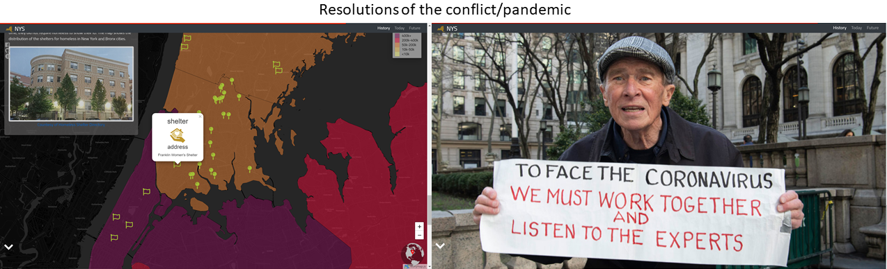

# storymap

 <br>
## Resilience Story of New York<br>
### :newspaper: Introduction
The aim of this storymap is to represent the strugggles of the people of New York State in the face of **`COVID-19 pandemic`**, that is complicated with unresolved social-economic inequity. This storymap is inspired by the success of digital technology-based storymaps in mobilizing social power towards a desired change (James, Kitchin and Leszczynski 2018, 26) through storymaps.<br>

> According to notable scholar [Holling](https://core.ac.uk/download/pdf/52941869.pdf), **`resilience`** is the persistence of relationships within a system. It is a measure of the ability of the systems to absorb changes.

> *Digital Geography** is a set of technologies that go beyond an engagement with an interface, but also involve spatial big data. DUe to its social power, one even called the story map as **`human document`**[TeachMideast](https://teachmideast.org/articles/digital-geography-applications/).<br>

### :hammer: Storyline
In the process of creating this storymap, I primarily developed the storyline by referring to the compeling work of [Song, Z.](https://link.springer.com/book/10.1007%2F978-3-030-04028-4). The audience of the storymap is all types of audience. I used **New York State** as the locus because of its position as the **`epicenter of this country's pandemic`**. It is hoped that users can gain important insights from the lived experience of people in New York State in the wake of COVID-19.<br>Among different types of **`GENRES`**  offered in Roth's Taxonomy (2016), I adopt **multimedia experienced genre**  which uses *layout, text, images, and graphics hyperlinks* as ways to enforce **systematic narrative**. Below are the sketches and brief descriptions of the map's storyline.<br>

The **`first page`** contains a video of New York City during pandemic which I obtained from [The New Yorkers](https://www.youtube.com/watch?v=rYTNO_WtNys) youtube. To dramatize, I transformed the nuance of the video into a vintage (old). On this page, users can also access links related to New York State (i.e., history, present conditions, and future resilient city ), real-time data of COVID-19 case, NY State Government's official website, and social media. The **`second page`** contains the first scene of the story, that is the introduction of the COVID-19 issue in May 2020 in this state. <br>

<br>

The **`third page`** contains the second scene of the story entitled Pause Orderthat invited different responses of people in the U.S. The **`fourth page`** contains the third scene of the story called outrage. This scene specifically explains the protests throughout U.S. which unfortunately led to violence and anarchy. I associated the incidents with the violence firearm rate data in 2017 at country level. <br>

<br>

The **`fifth page`** contains the fourth scene called Poverty. I attempt to link the data of violence rate with poverty level. To represent poverty, I used median household income level data in 2015 at state level. The **`sixth page`** contains the last scene called volunteer where heroism acts increase during the pandemic. Among many evidences of this, I used food pantry and homeless shelter to demonstrate the good value that people learn from this challenge.<br>.

<br>

The **`seventh page`** is the end of the storymap with 'working together' and 'trusting scientists' suggested by a local ctizen as the resolution of the pandemic and the following man-made disaster.<br>

<br>

The 3 narrative elements of this web map include:
<br>
1. **Set-Up Act**<br>
In terms of **`settings`**, the locus of this storymap is **New York State** that comprises 62 counties. The **`key characters`** involved are the citizens of the **New York State** and the **Governor Andrew Cuomo**. The **problem** is the pandemic that disrupts the lives of people in the New York State along with Governor's pause order that  raised public outrage and protests. The **time frame** is the current time where the pandemic and pause order are still taking place.<br>

<br>

2. **Conflict Act**<br>
The **`key issue`** of the story is the **vulnerability of people in New York State to the pandemic that increases as poverty and violance firearm rates of this state are relatively higher than other states in the U.S**. All factors associated with uncertainty in this state were transferred into thematic spatial maps (i.e., COVID-19 case, tweets over pause order, median household income, violance firearm rate, voluntary centers) in sequential and systematic/linear order. The linearity is aimed at showing the link between the socio-economic factors and its concentration in Bronx and New York cities. <br>

<br>

3. **Resolution Act**<br>
The **recommendations** offered are: 1) the need of people to embrace the pandemic as a opportunity to innovate, change, and reconsider the value of social cohesion to increase resilience to pandemic; 2) working together and listening to scientists to
deal with the pandemic as suggested by local residents and shown on the last page of this web map.<br>

<br>

## :mag_right: Data Sources
This storymap used data that are compiled from various and reliable resources belong to the U.S. government, electronic mass media, organization's websites, and twitter. For creating spatial maps, most of these data, need to be converted into GeoJson file. Besides that, for attaching icon or markert using *pointToLayer* to map, I added longitude and latitude of the location of each food pantry and homeless shelter. To obtain the location coordinates, I firstly accessed the addresses of those places via google map. <br>

| Data file | Data Type | Description| Sources |
| --------- | --------- | ---------- | ------- |
| uscases.geojson | vector | Number of COVID-19 cases and tests run in the U.S. based on CDC's report on May 13, 2020 | https://github.com/datasets/covid-19/tree/master/data |
| tweets.geojson | vector | Distribution of tweets corresponding to **pause order**. Data were gathered by using tweets crawling on June 5, 2020 | Tweeter |
| nys_viol_rate.geojson | vector | Index, Violent, property and firearm rates in NY states on November 2017| https://catalog.data.gov/dataset/index-violent-property-and-firearm-rates-by-county-beginning-1990/resource/d1e392ad-8377-4ca7-8b36-7c43bb275afc |
| nyspvt.geojson | vector | Median household income of New York State in 2015 with longitude and latitude coordinates | https://data.ny.gov/Energy-Environment/NYSERDA-Low-to-Moderate-Income-New-York-State-Cens/bui8-bb6g/data |
| shelter.geojson | vector | Locations of homeless shelters in Bronx in May 2020 with longitude and latitude coordinates | https://www.homelessshelterdirectory.org/cgi-bin/id/city.cgi?city=bronx&state=NY |
| food.geojson | vector | Location of food pantries in Bronx and surrounding in May 2020 with longitude and latitude coordinates | https://www.foodpantries.org/ci/ny-bronx |

<br>
To enable the **pointToLayer** to be used on spatial maps, the geojson data that I retrieved from many sources, were added with longitude and latitude coordinates. These cordinates were obtained from **`googlemaps.`** For the layers' colors, I utilized A [bivariate choropleth palette benerator](https://jakobzhao.github.io/storymap/assets/color.html).

## :books: Libraries
Below is the table that shows the data library of this storymap.

| **Library**       | **Version** | **Function**                                                                                                                   |
| ----------------- | ----------- | ------------------------------------------------------------------------------------------------------------------------------ |
| leaflet.css       | 1.4.0       | Codes for storymap making (e.g., events, animation)                                                                            |
| ajax              | 3.5.2       | Animation                                                                                                                      |
| googleapis        |             | Fonts and stylesheets                                                                                                          |
| fontawesome       | 5.7.2       | Icon markers                                                                                                                   |
| chroma            | 1.3.4       | Colors setting (e.g., chloropleth)                                                                                             |
| jquery            | 3.2.1       | Animation                                                                                                                      |
| popper.js         | 1.14.0      | Positioning engine by calculating the position of an element to make it possible to position it near a given reference element |
| bootstrap.min.css | 4.3.1       | Building responsive web map through complied source codes of css and js                                                        |
| leaflet-ajax      | 2.1.0       | Asynchronously adding geojson data                                                                                             |
| topojson.min.js   |             | Etension of GeoJSON that encodes topology                                                                                      |
| storymap          | 2.5         | Support storymap and make it robust and lightweight                                                                            |

The basemap used for this storymap is attributed to cartodb_basemaps with code as follows:
```js
cartodb_dark: {
  layer: L.tileLayer('http://cartodb-basemaps-{s}.global.ssl.fastly.net/dark_all/{z}/{x}/{y}@2x.png', {
    attribution: "Generated by QMetaTiles",
    detectRetina: true
```

The miniglobe added to the storymap was retrieved from Chris Whong's leaflet example in the github with URL: https://github.com/chriswhong/leaflet-globeminimap/blob/master/example/index.html.

## :lock_with_ink_pen: Guides for Users
The **`User Interface`** and **`User Experience`** Designs are two crucial components of a storymap. The User Experience (UX) relates with elements that are used to effectively influence users' experience, perceptions, and easiness in accessing the web map. The UI design  focuses on the appearance, presentation, and interactivity of the web map with user. For these two components, I used the following techniques and codes: <br>
- retrieving detailed information from **popup** that appears as users click over specific state<br><br>
- zooming in and zooming out the map with accordance to their needs through **zoom control** and flying to areas of concern: Bronx and New York cities through **animated zoom** <br><br>
- navigating pages through **animated arrow** and returning to the first page by clicking **home icon** on the last page of the storymap<br><br>
- having **links** to sources about the history and present time of New York State, and future resilient city that might inspire New York State.<br><br><br>
- having **links** to facebook, github, and brief information about the storymap.<br><br><br>

## :flags: Credits/Acknowledgement
This storymap is possible to be developed due to the contributions of following institutons, organizations, and individuals:
- New York State Government for its open source database that allows the storymap to be developed
- U.S. Center of Disease Control and Prevention for providing recent data of COVID-19 cases in the U.S.
- Taylor DesOrmeau for article *What’s the difference between Michigan’s stay-at-home order and state of emergency?* in the [mlive.com](https://www.mlive.com/public-interest/2020/04/whats-the-difference-between-michigans-stay-at-home-order-and-state-of-emergency.html)
-  Lazaro Gamio for article *State By State: Comparing Coronavirus Death Rates Across U.S.* in the [New York Times](https://www.nytimes.com/interactive/2020/04/22/us/coronavirus-death-rates.html)
-  Orion Rummier and Rebecca Falconer for article *In photos: Groups protest coronavirus lockdowns across the U.S.* in the [Axios](https://www.axios.com/coronavirus-protest-social-distancing-1bc7fb5a-b94c-471e-adf2-c50bfad4f242.html)
-  Robin Abcarian for article *Column: Gun-toting Republicans ignoring quarantine orders? Yes, even coronavirus has become part of the culture wars* in the [Los Angeles Times](https://www.latimes.com/opinion/story/2020-04-17/column-gun-toting-republicans-ignoring-quarantine-orders-yes-even-coronavirus-has-become-part-of-the-culture-wars)
-  Julianne Malveaux for article *What Others Are Saying Homelesness Crisis: We are Better than This* in the [New Orleans Tribune](https://theneworleanstribune.com/what-others-are-saying-homelessness-crisis-we-are-better-than-this/)
-  Foodpantries.org for [foodbank list](https://www.foodpantries.org/ci/ny-bronx) in Bronx
-  Homelessshelterdirectory.org for [homeless shelter](https://www.homelessshelterdirectory.org/cgi-bin/id/shelter.cgi?shelter=20310) in Bronx
-  The NewYorker for the inspiring [video](https://www.youtube.com/watch?v=rYTNO_WtNys) *The Streets of New York City Under Quarantine)*
- Professor Bo Zhao instructor of GEOG 458 coursework at the University of Washington, Seattle for advisory and guidance that allows the improvement of this storymap. <br>

### :link: References
[1] [Chris Whong](https://github.com/chriswhong/leaflet-globeminimap/blob/master/example/index.html), https://github.com/chriswhong/leaflet-globeminimap/blob/master/example/index.html<br>
[2] [Holling, C.S.](https://core.ac.uk/download/pdf/52941869.pdf), (1973), *Resilience and Stability of Ecological System*<br>
[3] [Jacob Bo Zhao](https://jakobzhao.github.io/storymap/assets/color.html), https://jakobzhao.github.io/storymap/assets/color.htm <br>
[4] [Jacob Bo Zhao](https://jakobzhao.github.io/storymap/examples/2.5/styles.html), https://jakobzhao.github.io/storymap/examples/2.5/styles.html<br>
[5] [Leaflet](https://leafletjs.com/plugins.html), https://leafletjs.com/plugins.html<br>
[6] [Song, Z.](https://link.springer.com/book/10.1007%2F978-3-030-04028-4), (2017), *Map-Based Visual Storytelling: An Assessment of Emerging Genres and Tropes*, University of Wisconsin-Madison<br>
[7] [TeachMideast](https://teachmideast.org/articles/digital-geography-applications/), (2020), *TeachMideast*, Middle East <br>
